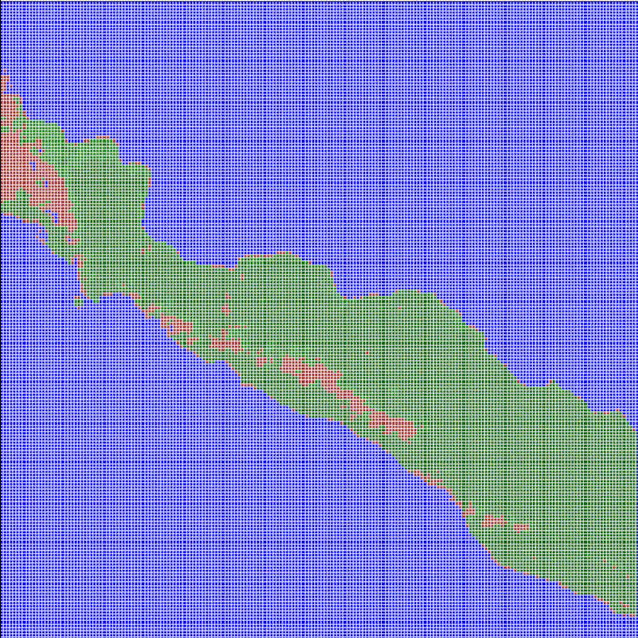
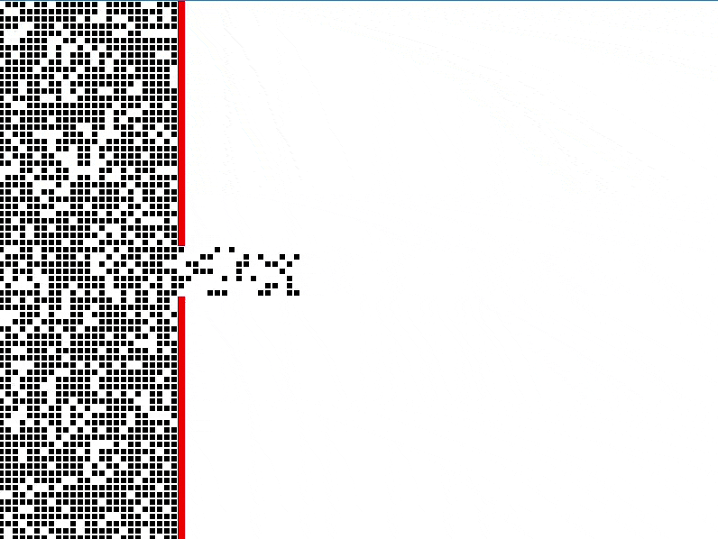

# Discrete Modelling Projects

This repository contains a collection of projects developed for the **Discrete Modelling** course. The main focus of the course was the use of **cellular automata** for simulating physical phenomena and basic image processing tasks.

All code is written in **Python**, and each lab exercise is organized in its own folder (`lab_01` to `lab_10`).

The course was divided into two main parts:
- **Lab 01–Lab 05**: Focused on image processing using grayscale maps, including brightness manipulation and thresholding. These labs concluded with a forest fire simulation based on cellular automata.
- **Lab 06–Lab 10**: Dedicated to simulations using the **Lattice Boltzmann Method (LBM)**, continuing with cellular automata as the core modeling technique.

## 📁 Repository Structure

📦Discrete-modelling/  
 ┣ 📂assets/  
 ┣ 📂lab_01/  
 ┣ 📂lab_02/  
 ┣ 📂lab_03/  
 ┣ 📂lab_04/  
 ┣ 📂lab_05/  
 ┣ 📂lab_06/  
 ┣ 📂lab_07/  
 ┣ 📂lab_08/  
 ┣ 📂lab_09/  
 ┣ 📂lab_10/  
 ┗ 📜README.md


More detailed descriptions of each lab can be found in the sections below.

## `lab_01` – Image Processing: Brightness Adjustment and Binarization

This lab introduces basic image processing techniques using the Python Pillow library. The main focus is on manipulating image brightness and applying binary thresholding to grayscale images.

**Features**:

- **Image darkening** by a user-defined percentage (1–99%)
- **Image brightening** in 3 steps using a percentage (10–20%)
- **Binary thresholding** at fixed (50%) and custom threshold levels

**Used libraries**:

- `Pillow` (Python Imaging Library fork)

**Example flow**:

1. Loads a grayscale `.bmp` image (`Mapa_MD_no_terrain_low_res_Gray.bmp`)
2. User inputs percentage values to:
    - Darken the image
    - Brighten the image in 3 increasing steps
    - Apply binary thresholding

3. Outputs:
    - `darkened_image_by_X%.bmp`
    - `brightened_image_step_1.bmp`, `step_2`, `step_3`
    - `binary_image_50%.bmp`
    - `binary_image_custom.bmp`

**Code entry point**:

```bash
python main.py
```

>💡 Tip: You can easily modify threshold levels or brightness ranges in main.py to experiment with different visual effects.

### Lab 01 – Output Preview


## `lab_02` – Morphological Operations and Convolution Filtering

This lab extends image processing capabilities by applying **morphological transformations and convolution-based filtering**.

**Features**:

- **Binary thresholding** of input images
- Morphological operations:

    - **Dilation**
    - **Erosion**
    - **Opening**
    - **Closing**

- **Convolution filters** using custom kernel masks (e.g., Gaussian blur, edge detection)
- Support for different **border handling** strategies:

    - `constant`
    - `replicate`
    - `reflect`
    - `wrap`

**Used libraries**:

- `Pillow`
- `NumPy`

**Example pipeline**:

- Load image and kernel masks from file
- Apply:

    - Morphological transformations on binary mask
    - Convolution filters on grayscale and color images

- Save multiple result images for comparison

**Input files**:

- `cat.bmp`, `Mapa_MD_no_terrain_low_res_Gray.bmp` — images
- `gauss.txt`, `simple_upper_pass.txt` — convolution masks

**Output**:

The script saves processed images like:

- `zad_1_1.bmp`, `zad_1_2.bmp`, `zad_1_3.bmp` (morphological ops)
- `zad_2_1_1.bmp`, ..., `zad_2_2_2.bmp` (convolutions)
- `binary.bmp`

### Lab 02 – Output Preview


## `lab_03` – 1D Cellular Automaton with Rule-based Evolution

In this lab, a one-dimensional binary cellular automaton is implemented using custom rule sets. The system evolves over time based on rules similar to those described by Stephen Wolfram.

**Features**:

- Binary states: each cell can be `0` or `1`
- Supports both `absorbing` and `periodic` boundary conditions
- Uses a list of rules (e.g. `[41, 69, 65, 190]`) to update the state in cycles
- User-defined initial state:

    - Manual input (e.g. `0, 1, 1, 0, 1`)
    - Or `"random"` with specified length

- Saves the automaton state evolution to `.csv`
- Visualizes the evolution grid as a color-coded matrix

**Key Functions**:

- `automaton(...)`: core simulation logic
- `handle_border(...)`: boundary behavior handler
- `compute_new_state(...)`: applies rule to determine next cell value
- `visualize_grid(...)`: uses `matplotlib` to draw a grid of the simulation

**Output**:

- `automaton_output.csv` – each row represents the state at a given time step
- Plot showing cell states over time (orange = 1, white = 0)

### Lab 03 – Input Preview


### Lab 03 – Output Preview


## `lab_04` – Conway's Game of Life with Interactive GUI

In this lab, the classic Conway’s Game of Life is implemented with a fully interactive Tkinter GUI and Matplotlib visualizations. The user can experiment with various initial patterns, boundary conditions, and animation settings.

**Features**:

- Real-time animation of the Game of Life in a Tkinter window
- Multiple **preset patterns** like:

    - `glider`, `oscillator`, `spaceship`, `acorn`, `snake_pit`, `glider_gun`, and more

- Supports **periodic** and **reflective** boundary conditions
- Zoom and pan functionality via mouse interaction
- Adjustable speed via slider
- GUI elements for:

    - Pattern selection
    - Start/pause/reset
    - Iteration counter
    - Boundary mode selection

**Structure**:
- `main.py` – entry point that launches the GUI
- `game_of_life_logic.py` – logic for cell updates, neighborhood calculation, and pattern loading
- `game_of_life_gui.py` – handles all GUI components and animation using Tkinter and Matplotlib

**How to run**:

```bash
python main.py
```

### Lab 04 – Output Preview


## `lab_05` – Forest Fire Simulation with Wind, Humidity, and GUI Control

This lab presents a fully interactive simulation of forest fire dynamics using cellular automata. The simulation is visualized in a GUI built with Tkinter and Matplotlib, where the user can control fire behavior, apply actions, and observe the effect of environmental conditions.

**Features**:

- Forest grid simulation with multiple terrain types:

    - Soil, coniferous & deciduous trees, burning stages, water, saplings, craters

- **Custom wind direction & strength** with effect on fire spread
- **Humidity control**: affects fire probability
- **Tree regeneration** based on cooldowns
- Mouse interaction:

    - Apply actions: fire, extinguish, plant tree, dig, incendiary bomb, etc.
    - Click & drag editing

- Map-based initialization from images (e.g. `map_1`, `map_2`)

**User Interface**:

- Start/pause/reset animation
- Speed control
- Preset terrain layouts
- Boundary condition switch (periodic/reflective)
- Visual zoom and pan (scroll or arrow keys)

**Simulation states**:

| Code      | Meaning            |
| --------- | ------------------ |
| 0         | Ground             |
| 1         | Coniferous tree    |
| 2         | Tree catching fire |
| 3         | Fully burning tree |
| 4         | Burned tree        |
| 5         | Water              |
| 6         | Regrowing tree     |
| 7         | Deciduous tree     |
| 8         | Crater (dug hole)  |

### Lab 05 – Output Preview



> - Wind affects the probability of ignition in directional cones.
> - Humidity reduces ignition chance.
> - Regrowing trees and manual fire extinguishing possible.

**Example input maps**:

- `map_1` to `map_4` (`.png`, `.jpg`) – color-coded terrains
- `wietnam.png` – custom terrain with water channels

**Structure**:

- `main.py` – launches the GUI
- `fire_simulation_gui.py` – handles GUI logic and user interactions
- `fire_simulation_logic.py` – contains fire spread mechanics and grid updates

**Run with**:

```bash
python main.py
```

## `lab_06` – Lattice Gas Automaton: Gas Expansion Through a Hole

This lab implements a 2D Lattice Gas Automaton (LGA) to simulate gas particles spreading through a hole in a wall that separates two compartments. The system evolves over time using discrete-time steps, with particle collisions and directional movement handled according to simple LGA rules.

**Simulation scenario**:

- A container is initially filled with gas on the left side of a vertical wall.
- A hole in the wall allows the gas to flow into the right side.
- Over time, particles spread and distribute evenly across the entire box.

**Features**:

- Fully visualized with Pygame
- Interactive GUI with:

    - Start / Stop / Reset buttons

- LGA logic with:

    - 4-directional streaming: up, down, left, right
    - Elastic collisions (e.g., 2 particles opposite → redirect)

- Red wall with a central hole that permits particle passage
- Visualization of particle density per cell

### Lab 06 – Output Preview



> A simple yet powerful demonstration of emergent behavior from local rules.\
> The automaton conserves particles and models gas diffusion qualitatively.

**Cell state logic**:

Each cell tracks particle directions as `[up, right, down, left]`.
Particles are moved during the streaming phase and redirected during the collision phase if they meet head-on.

**Structure**:

- `main.py` – runs the simulation loop and GUI
- `lga_logic.py` – handles the LGA steps, wall and grid management
- `cell.py` – contains the state and behavior of a single cell
- `wall.py` – generates a wall with a configurable hole
- `lga_visualization.py` – handles drawing the grid and UI elements
- `constants.py` – stores all simulation parameters and color settings

**Run with**:

```bash
python main.py
```

## `lab_07` – Lattice Boltzmann Method: Diffusion Through a Hole

In this lab, the discrete Lattice Boltzmann Method (LBM) is implemented to simulate gas diffusion in a 2D box. A vertical wall with a hole separates two regions: the left side is filled with gas, which gradually diffuses to the right.

**Physical Model**:

- **LBM (D2Q4)** – four velocity directions: up, right, down, left
- Simulates mass distribution via local collisions and streaming
- Simple **BGK (single-relaxation-time)** collision model
- Tracks scalar field (concentration/density)

**Features**:

- Discrete streaming and collision steps with optimized NumPy + `@njit` (via `numba`)
- Wall with a controllable hole in the middle
- Mass conservation check at each step
- Real-time density visualization using grayscale intensity
- Adjustable animation speed

**User interface**:

- Built with Pygame
- Buttons: Start / Stop / Reset / Speed Up / Slow Down
- Display of current simulation speed
- Wall shown in red; density shown from white (max) to black (min)

**Code structure**:

| File                   | Description                                            |
| ---------------------- | ------------------------------------------------------ |
| `main.py`              | Simulation loop and UI logic                           |
| `lbm_logic.py`         | Core LBM engine (collision, streaming, density update) |
| `lbm_visualization.py` | Renders current density state and handles buttons      |
| `wall.py`              | Generates static wall with a hole                      |
| `constants.py`         | Configuration: sizes, tau, colors, velocities          |

### Lab 07 – Output Preview


> Gas particles slowly flow from the left region into the right through a narrow hole, until equilibrium is reached.\
> Real-time tracking of left/right mass balance is included for validation.

**Run with**:

```bash
python main.py
```

## `lab_08` – Lattice Boltzmann Method: Fluid Flow and Velocity Fields

This lab builds upon the previous LBM simulation and implements the **D2Q9 model** to simulate **fluid flow** through a narrow slit in a wall. It features real-time visualization of:

- **Density**
- **Horizontal velocity (Ux)**
- **Vertical velocity (Uy)**

**Model Summary**:

- **LBM D2Q9** with 9 discrete velocity directions
- **BGK collision model** (single relaxation time)
- Wall with a configurable **central slit** (narrow opening)
- Streaming and collision steps optimized with `numba`
- Real-time calculation of:

  - **Density field**
  - **Velocity components** (Ux, Uy)

**Visualization**:

- Three-panel display using **Pygame**
- Each panel shows:

  - Left: density (white = high, black = low)
  - Center: Ux (red = rightward, blue = leftward)
  - Right: Uy (red = downward, blue = upward)

- Velocity values are **clipped** and color-mapped to preserve interpretability

**Controls**:

- Buttons: Start / Stop / Reset / Speed Up / Slow Down
- Speed and iteration counters
- Debug prints for density and velocity values

**Code Structure**:

| File                   | Description                                                       |
| ---------------------- | ----------------------------------------------------------------- |
| `main.py`              | UI and simulation control                                         |
| `lbm_logic.py`         | D2Q9 LBM implementation: collision, streaming, macroscopic fields |
| `lbm_visualization.py` | Visualizes density, Ux, Uy with color mapping                     |
| `wall.py`              | Generates vertical wall with configurable hole                    |
| `constants.py`         | Configurable simulation parameters and color/velocity definitions |

### Lab 08 – Output Preview


> The fluid initially concentrated on the left side of the wall diffuses through the slit.\
> Velocity vectors reveal the dynamics of flow symmetry, acceleration near the slit, and eventual equilibrium.

## `lab_09` – Lattice Boltzmann Method: Boundary Conditions Comparison

This lab extends the LBM fluid flow simulation with support for **multiple boundary conditions**, allowing comparison of their effects on velocity and density profiles in a flow channel.

**Available Boundary Conditions**:

- `"bounce-back"` – simulates solid wall reflection (no-slip)
- `"constant"` – injects a **constant horizontal flow**
- `"custom"` – mixed approach: linear velocity profile on the left, fixed density at the right

Each boundary mode can be **switched at runtime** via GUI buttons.

**Visualization**:

Just like in lab 08, the screen is split into 3 side-by-side views showing:

- Density field
- X-component of velocity
- Y-component of velocity

Color encoding:

- **Density**: white (high) to black (low)
- **Ux**: red (positive) and blue (negative)
- **Uy**: same principle (up/down flow)

**Key Features**:

- D2Q9 LBM implementation with BGK (single relaxation time)
- Real-time **mass conservation check**
- Velocity clamping to ensure stability
- Full **Numba optimization** of compute-heavy steps
- Custom equilibrium calculation and stream routines

**Controls**:

- Start / Stop
- Switch boundary conditions: `"bounce-back"`, `"constant"`, `"custom"`
- Adjust simulation speed with `+` and `–`
- See current speed, iteration count, and boundary mode live on screen

**Code Layout**:

| File                   | Purpose                                                   |
| ---------------------- | --------------------------------------------------------- |
| `main.py`              | Main loop and GUI logic                                   |
| `lbm_logic.py`         | Core LBM physics, including condition-dependent streaming |
| `lbm_visualization.py` | GUI rendering for multiple modes                          |
| `wall.py`              | Wall with central slit                                    |
| `constants.py`         | All numerical and graphical configuration                 |

### Lab 09 – Output Preview


## `lab_10` – Final LBM Simulation with Particles, Streamlines and State Saving

This is the most advanced version of the Lattice Boltzmann Method (LBM) simulation in your lab series. It combines fluid dynamics modeling with interactive visual tools and save/load functionality, making it a complete mini-simulation environment.

### **Key Features Added in Lab 10:**

**Tracer Particles**

- Particles move according to the local velocity field.
- Particle mass affects inertia (heavier = slower response).
- Each particle leaves a visible **trajectory**.

**Streamlines**

- Visual representation of velocity direction (based on `ux` or `uy`).
- Automatically scaled for the field magnitude.

**State Saving and Loading (`.json`)**

- Saves:

  - Fields: `rho`, `ux`, `uy`, `f_in`, `f_out`
  - Particles (position, mass, color, path)
  - Wall structure
  - Boundary condition and iteration count

- Full simulation state can be restored anytime.

**Export Visual Frames to BMP**

- Each mode (`density`, `ux`, `uy`) can be saved as `.bmp` using PIL.
- Includes streamlines and particles if visible.

**Interactive Boundary Conditions**

Switch between:

- `"bounce-back"` — walls reflect the flow
- `"constant"` — fixed velocities on boundaries
- `"custom"` — mixed inflow/outflow with open boundaries

**File Structure Overview**:

| File                   | Description                                          |
| ---------------------- | ---------------------------------------------------- |
| `main.py`              | Main loop, GUI interactions, handles state changes   |
| `lbm_logic.py`         | Physics engine (LBM), particle logic, save/load      |
| `lbm_visualization.py` | Drawing logic: grid, buttons, streamlines, particles |
| `wall.py`              | Generates wall with a central opening                |
| `particle.py`          | Represents a colored particle with mass and history  |
| `constants.py`         | Parameters (grid, colors, physical values)           |

**Technical Highlights**:

- **`Numba`** is used (`@njit`) to optimize collision, streaming and equilibrium functions.
- Particles interact visually with the velocity field but do not alter it.
- Supports multiple LBM boundary condition models — easy to compare physical behaviors.
- The system can be paused, saved, and resumed without losing any state.

### Lab 10 – Output Preview


> The simulation models 2D fluid flow through a chamber with an obstacle.\
> Density, X-velocity, and Y-velocity fields are visualized in parallel views.\
> Particles trace the flow paths, while streamlines indicate directional behavior.\
> Users can save the simulation at any time, and reload it later for continued analysis.
