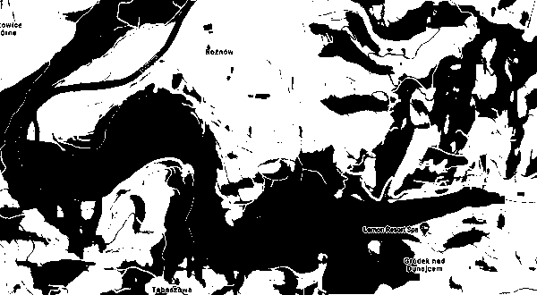
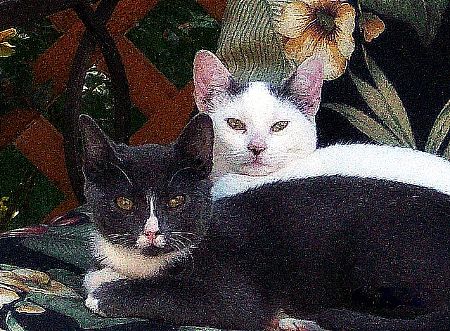
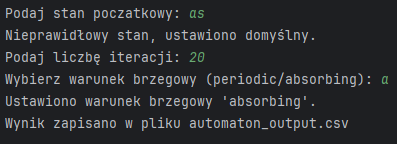
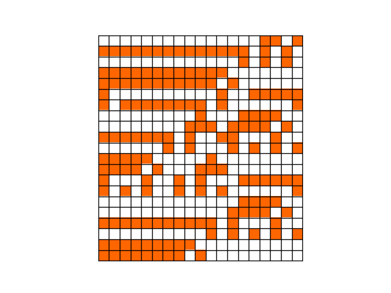
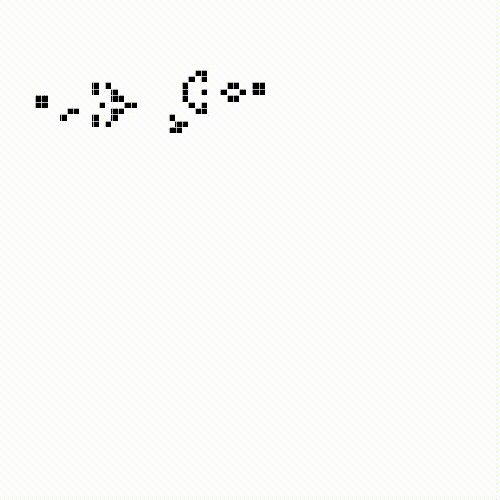

# Discrete Modelling Projects

This repository contains a collection of projects developed for the **Discrete Modelling** course. The main focus of the course was the use of **cellular automata** for simulating physical phenomena and basic image processing tasks.

All code is written in **Python**, and each lab exercise is organized in its own folder (`lab_01` to `lab_10`).

The course was divided into two main parts:
- **Lab 01–Lab 05**: Focused on image processing using grayscale maps, including brightness manipulation and thresholding. These labs concluded with a forest fire simulation based on cellular automata.
- **Lab 06–Lab 10**: Dedicated to simulations using the **Lattice Boltzmann Method (LBM)**, continuing with cellular automata as the core modeling technique.

## 📁 Repository Structure

📦Discrete-modelling/  
 ┣ 📂assets/  
 ┣ 📂lab_01/  
 ┣ 📂lab_02/  
 ┣ 📂lab_03/  
 ┣ 📂lab_04/  
 ┣ 📂lab_05/  
 ┣ 📂lab_06/  
 ┣ 📂lab_07/  
 ┣ 📂lab_08/  
 ┣ 📂lab_09/  
 ┣ 📂lab_10/  
 ┗ 📜README.md


More detailed descriptions of each lab can be found in the sections below.

## `lab_01` – Image Processing: Brightness Adjustment and Binarization

This lab introduces basic image processing techniques using the Python Pillow library. The main focus is on manipulating image brightness and applying binary thresholding to grayscale images.

**Features**:

- **Image darkening** by a user-defined percentage (1–99%)
- **Image brightening** in 3 steps using a percentage (10–20%)
- **Binary thresholding** at fixed (50%) and custom threshold levels

**Used libraries**:

- `Pillow` (Python Imaging Library fork)

**Example flow**:

1. Loads a grayscale `.bmp` image (`Mapa_MD_no_terrain_low_res_Gray.bmp`)
2. User inputs percentage values to:
    - Darken the image
    - Brighten the image in 3 increasing steps
    - Apply binary thresholding

3. Outputs:
    - `darkened_image_by_X%.bmp`
    - `brightened_image_step_1.bmp`, `step_2`, `step_3`
    - `binary_image_50%.bmp`
    - `binary_image_custom.bmp`

**Code entry point**:

```bash
python main.py
```

💡 Tip: You can easily modify threshold levels or brightness ranges in main.py to experiment with different visual effects.

### Lab 01 – Output Preview



## `lab_02` – Morphological Operations and Convolution Filtering

This lab extends image processing capabilities by applying **morphological transformations and convolution-based filtering**.

**Features**:

- **Binary thresholding** of input images
- Morphological operations:

    - **Dilation**
    - **Erosion**
    - **Opening**
    - **Closing**

- **Convolution filters** using custom kernel masks (e.g., Gaussian blur, edge detection)
- Support for different **border handling** strategies:

    - `constant`
    - `replicate`
    - `reflect`
    - `wrap`

**Used libraries**:

- `Pillow`
- `NumPy`

**Example pipeline**:

- Load image and kernel masks from file
- Apply:

    - Morphological transformations on binary mask
    - Convolution filters on grayscale and color images

- Save multiple result images for comparison

**Input files**:

- `cat.bmp`, `Mapa_MD_no_terrain_low_res_Gray.bmp` — images
- `gauss.txt`, `simple_upper_pass.txt` — convolution masks

**Output**:

The script saves processed images like:

- `zad_1_1.bmp`, `zad_1_2.bmp`, `zad_1_3.bmp` (morphological ops)
- `zad_2_1_1.bmp`, ..., `zad_2_2_2.bmp` (convolutions)
- `binary.bmp`

### Lab 02 – Output Preview



## `lab_03` – 1D Cellular Automaton with Rule-based Evolution

In this lab, a one-dimensional binary cellular automaton is implemented using custom rule sets. The system evolves over time based on rules similar to those described by Stephen Wolfram.

**Features**:

- Binary states: each cell can be `0` or `1`
- Supports both `absorbing` and `periodic` boundary conditions
- Uses a list of rules (e.g. `[41, 69, 65, 190]`) to update the state in cycles
- User-defined initial state:

    - Manual input (e.g. `0, 1, 1, 0, 1`)
    - Or `"random"` with specified length

- Saves the automaton state evolution to `.csv`
- Visualizes the evolution grid as a color-coded matrix

**Key Functions**:

- `automaton(...)`: core simulation logic
- `handle_border(...)`: boundary behavior handler
- `compute_new_state(...)`: applies rule to determine next cell value
- `visualize_grid(...)`: uses `matplotlib` to draw a grid of the simulation

**Output**:

- `automaton_output.csv` – each row represents the state at a given time step
- Plot showing cell states over time (orange = 1, white = 0)

### Lab 03 – Input Preview



### Lab 03 – Output Preview



## `lab_04` – Conway's Game of Life with Interactive GUI

In this lab, the classic Conway’s Game of Life is implemented with a fully interactive Tkinter GUI and Matplotlib visualizations. The user can experiment with various initial patterns, boundary conditions, and animation settings.

**Features**:

- Real-time animation of the Game of Life in a Tkinter window
- Multiple **preset patterns** like:

    - `glider`, `oscillator`, `spaceship`, `acorn`, `snake_pit`, `glider_gun`, and more

- Supports **periodic** and **reflective** boundary conditions
- Zoom and pan functionality via mouse interaction
- Adjustable speed via slider
- GUI elements for:

    - Pattern selection
    - Start/pause/reset
    - Iteration counter
    - Boundary mode selection

**Structure**:
- `main.py` – entry point that launches the GUI
- `game_of_life_logic.py` – logic for cell updates, neighborhood calculation, and pattern loading
- `game_of_life_gui.py` – handles all GUI components and animation using Tkinter and Matplotlib

**How to run**:

```bash
python main.py
```

### Lab 04 – Output Preview


